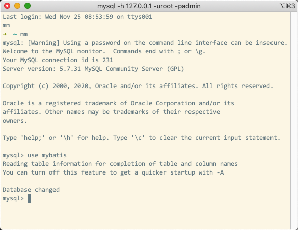
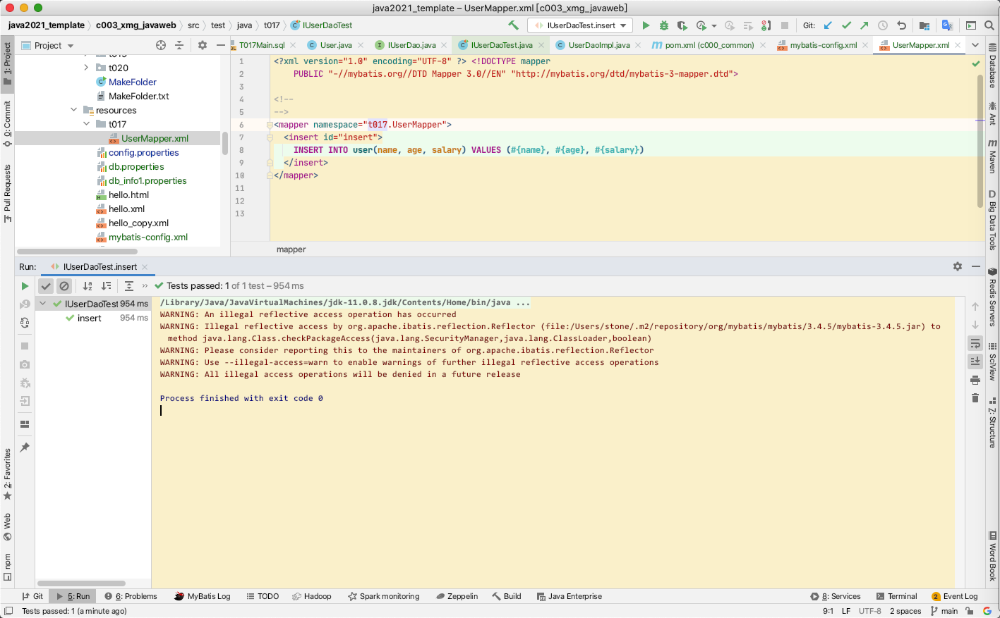

## 表整理

## insert数据整理

## lambda表达式整理

Reading table information for completion of table and column names
You can turn off this feature to get a quicker startup with -A

WARNING: An illegal reflective access operation has occurred
WARNING: Illegal reflective access by org.apache.ibatis.reflection.Reflector (file:/Users/stone/.m2/repository/org/mybatis/mybatis/3.4.5/mybatis-3.4.5.jar) to method java.lang.Class.checkPackageAccess(java.lang.SecurityManager,java.lang.ClassLoader,boolean)
WARNING: Please consider reporting this to the maintainers of org.apache.ibatis.reflection.Reflector
WARNING: Use --illegal-access=warn to enable warnings of further illegal reflective access operations
WARNING: All illegal access operations will be denied in a future release

