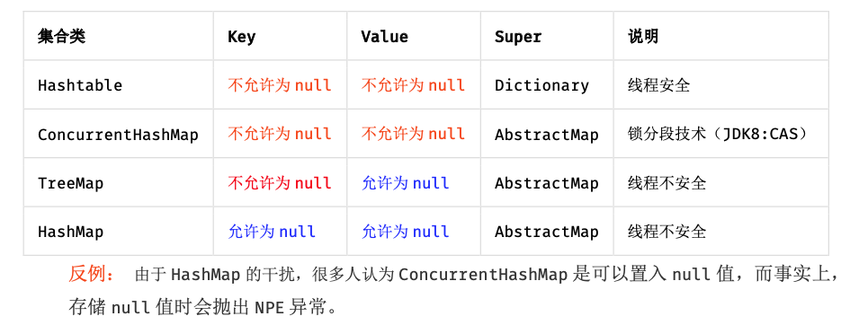

# 阿里巴巴Java开发手册(终极版)

下载：<a target="_blank" href="/src/学习相关/000_命名规范/阿里巴巴Java开发手册(终极版).pdf">阿里巴巴Java开发手册(终极版).pdf</a>


## 命名风格
1. 【强制】代码中的命名均不能以下划线或美元符号开始，也不能以下划线或美元符号结束。
```plain
反例：_name / __name / $Object / name_ / name$ / Object$
```

2. 【强制】代码中的命名严禁使用拼音与英文混合的方式，更不允许直接使用中文的方式。
   说明：正确的英文拼写和语法可以让阅读者易于理解，避免歧义。注意，即使纯拼音命名方式
   也要避免采用。
```plain
正例：alibaba / taobao / youku / hangzhou 等国际通用的名称，可视同英文。
反例：DaZhePromotion [打折] / getPingfenByName() [评分] / int 某变量 = 3
```

3. 【强制】类名使用 UpperCamelCase 风格，必须遵从驼峰形式，但以下情形例外：DO / BO / 
DTO / VO / AO
```plain
正例：MarcoPolo / UserDO / XmlService / TcpUdpDeal / TaPromotion
反例：macroPolo / UserDo / XMLService / TCPUDPDeal / TAPromotion
```
4. 【强制】方法名、参数名、成员变量、局部变量都统一使用 lowerCamelCase 风格，必须遵从
驼峰形式。
```plain
正例： localValue / getHttpMessage() / inputUserId
```
5. 【强制】常量命名全部大写，单词间用下划线隔开，力求语义表达完整清楚，不要嫌名字长。
```plain
正例：MAX_STOCK_COUNT
反例：MAX_COUNT
```
6. 【强制】抽象类命名使用 Abstract 或 Base 开头；异常类命名使用 Exception 结尾；测试类
命名以它要测试的类的名称开始，以 Test 结尾。
```plain
AbstractPerson
BaseViewController
MyArrayCustomException
HelloWorldTest
```

7. 【强制】中括号是数组类型的一部分，数组定义如下：String[] args;
```plain
反例：使用 String args[]的方式来定义。
```
8. 【强制】POJO 类中布尔类型的变量，都不要加 is，否则部分框架解析会引起序列化错误。
```plain
反例：定义为基本数据类型 Boolean isDeleted；的属性，它的方法也是 isDeleted()，RPC
阿里巴巴 Java 开发手册
——禁止用于商业用途，违者必究—— 2 /35
框架在反向解析的时候，“以为”对应的属性名称是 deleted，导致属性获取不到，进而抛出异
常。
```
9. 【强制】包名统一使用小写，点分隔符之间有且仅有一个自然语义的英语单词。包名统一使用
单数形式，但是类名如果有复数含义，类名可以使用复数形式。
```plain
正例： 应用工具类包名为 com.alibaba.open.util、类名为 MessageUtils（此规则参考
spring 的框架结构）
```
10. 【强制】杜绝完全不规范的缩写，避免望文不知义。
```plain
反例：AbstractClass“缩写”命名成 AbsClass；condition“缩写”命名成 condi，此类随
意缩写严重降低了代码的可阅读性。
```
11. 【推荐】为了达到代码自解释的目标，任何自定义编程元素在命名时，使用尽量完整的单词
组合来表达其意。
```plain
正例：从远程仓库拉取代码的类命名为 PullCodeFromRemoteRepository。
反例：变量 int a; 的随意命名方式。
```
12. 【推荐】如果模块、接口、类、方法使用了设计模式，在命名时体现出具体模式。
```plain
说明：将设计模式体现在名字中，有利于阅读者快速理解架构设计理念。
正例：public class OrderFactory;
public class LoginProxy;
public class ResourceObserver;
```
13. 【推荐】接口类中的方法和属性不要加任何修饰符号（public 也不要加），保持代码的简洁
性，并加上有效的 Javadoc 注释。尽量不要在接口里定义变量，如果一定要定义变量，肯定是
与接口方法相关，并且是整个应用的基础常量。
```plain
正例：接口方法签名：void f();
接口基础常量表示：String COMPANY = "alibaba";
反例：接口方法定义：public abstract void f();
说明：JDK8 中接口允许有默认实现，那么这个 default 方法，是对所有实现类都有价值的默
认实现。
```
14. 接口和实现类的命名有两套规则：
```plain
1）【强制】对于 Service 和 DAO 类，基于 SOA 的理念，暴露出来的服务一定是接口，内部
的实现类用 Impl 的后缀与接口区别。
正例：CacheServiceImpl 实现 CacheService 接口。
2）【推荐】如果是形容能力的接口名称，取对应的形容词做接口名（通常是–able 的形式）。
正例：AbstractTranslator 实现 Translatable。
```

15. 【参考】枚举类名建议带上 Enum 后缀，枚举成员名称需要全大写，单词间用下划线隔开。
```plain
说明：枚举其实就是特殊的常量类，且构造方法被默认强制是私有。
正例：枚举名字为 ProcessStatusEnum 的成员名称：SUCCESS / UNKOWN_REASON。
```
16. 【参考】各层命名规约：
```java
A) Service/DAO 层方法命名规约
    1） 获取单个对象的方法用 get 做前缀。
    2） 获取多个对象的方法用 list 做前缀。
    3） 获取统计值的方法用 count 做前缀。
    4） 插入的方法用 save/insert 做前缀。
    5） 删除的方法用 remove/delete 做前缀。
    6） 修改的方法用 update 做前缀。
B) 领域模型命名规约
    1） 数据对象：xxxDO，xxx 即为数据表名。
    2） 数据传输对象：xxxDTO，xxx 为业务领域相关的名称。
    3） 展示对象：xxxVO，xxx 一般为网页名称。
    4） POJO 是 DO/DTO/BO/VO 的统称，禁止命名成 xxxPOJO。
```

---

## 常量定义
1. 【强制】不允许任何魔法值（即未经定义的常量）直接出现在代码中。
```plain
反例：String key = "Id#taobao_" + tradeId;
cache.put(key, value);
```
2. 【强制】long 或者 Long 初始赋值时，使用大写的 L，不能是小写的 l，小写容易跟数字 1 混
淆，造成误解。
```plain
说明：Long a = 2l; 写的是数字的 21，还是 Long 型的 2?
```
3. 【推荐】不要使用一个常量类维护所有常量，按常量功能进行归类，分开维护。
```plain
说明：大而全的常量类，非得使用查找功能才能定位到修改的常量，不利于理解和维护。
正例：缓存相关常量放在类 CacheConsts 下；系统配置相关常量放在类 ConfigConsts 下。
```
4. 【推荐】常量的复用层次有五层：跨应用共享常量、应用内共享常量、子工程内共享常量、包
```plain
内共享常量、类内共享常量。
1） 跨应用共享常量：放置在二方库中，通常是 client.jar 中的 constant 目录下。
2） 应用内共享常量：放置在一方库中，通常是 modules 中的 constant 目录下。
反例：易懂变量也要统一定义成应用内共享常量，两位攻城师在两个类中分别定义了表示“是”的变量：
类 A 中：public static final String YES = "yes"; 
类 B 中：public static final String YES = "y"; 
A.YES.equals(B.YES)，预期是 true，但实际返回为 false，导致线上问题。
3） 子工程内部共享常量：即在当前子工程的 constant 目录下。
4） 包内共享常量：即在当前包下单独的 constant 目录下。
5） 类内共享常量：直接在类内部 private static final 定义。
```
5. 【推荐】如果变量值仅在一个范围内变化，且带有名称之外的延伸属性，定义为枚举类。下面
```plain
正例中的数字就是延伸信息，表示星期几。
正例：public Enum { MONDAY(1), TUESDAY(2), WEDNESDAY(3), THURSDAY(4), FRIDAY(5), SATURDAY(6), 
SUNDAY(7);}
```

---

## OOP 规约

1. 【强制】避免通过一个类的对象引用访问此类的静态变量或静态方法，无谓增加编译器解析成本，直接用类名来访问即可。
```plain
反例：person.COUNTRY
正例：Person.COUNTRY
```

2. 【强制】所有的覆写方法，必须加@Override 注解。
```plain
说明：getObject()与 get0bject()的问题。一个是字母的 O，一个是数字的 0，加@Override
可以准确判断是否覆盖成功。另外，如果在抽象类中对方法签名进行修改，其实现类会马上编译报错。
```
3. 【强制】相同参数类型，相同业务含义，才可以使用 Java 的可变参数，避免使用 Object。
```plain
说明：可变参数必须放置在参数列表的最后。（提倡同学们尽量不用可变参数编程）
正例：public User getUsers(String type, Integer... ids) {...}
```
4. 【强制】外部正在调用或者二方库依赖的接口，不允许修改方法签名，避免对接口调用方产生影响。接口过时必须加@Deprecated 注解，并清晰地说明采用的新接口或者新服务是什么。

5. 【强制】不能使用过时的类或方法。
```plain
说明：java.net.URLDecoder 中的方法 decode(String encodeStr) 这个方法已经过时，应
该使用双参数 decode(String source, String encode)。接口提供方既然明确是过时接口，
那么有义务同时提供新的接口；作为调用方来说，有义务去考证过时方法的新实现是什么。
```
6. 【强制】Object 的 equals 方法容易抛空指针异常，应使用常量或确定有值的对象来调用equals。
```plain
正例："test".equals(object);
反例：object.equals("test");
说明：推荐使用 java.util.Objects#equals（JDK7 引入的工具类）
```
7. 【强制】所有的相同类型的包装类对象之间值的比较，全部使用 equals 方法比较。
```plain
说明：对于 Integer var = ? 在-128 至 127 范围内的赋值，Integer 对象是在
IntegerCache.cache 产生，会复用已有对象，这个区间内的 Integer 值可以直接使用==进行
判断，但是这个区间之外的所有数据，都会在堆上产生，并不会复用已有对象，这是一个大坑，
推荐使用 equals 方法进行判断。
```
8. 关于基本数据类型与包装数据类型的使用标准如下：
```plain
1） 【强制】所有的 POJO 类属性必须使用包装数据类型。
2） 【强制】RPC 方法的返回值和参数必须使用包装数据类型。
3） 【推荐】所有的局部变量使用基本数据类型。
说明：POJO 类属性没有初值是提醒使用者在需要使用时，必须自己显式地进行赋值，任何
NPE 问题，或者入库检查，都由使用者来保证。
正例：数据库的查询结果可能是 null，因为自动拆箱，用基本数据类型接收有 NPE 风险。
反例：比如显示成交总额涨跌情况，即正负 x%，x 为基本数据类型，调用的 RPC 服务，调用
不成功时，返回的是默认值，页面显示为 0%，这是不合理的，应该显示成中划线。所以包装
数据类型的 null 值，能够表示额外的信息，如：远程调用失败，异常退出。
```
9. 【强制】定义 DO/DTO/VO 等 POJO 类时，不要设定任何属性默认值。
```plain
反例：POJO 类的 gmtCreate 默认值为 new Date();但是这个属性在数据提取时并没有置入具
体值，在更新其它字段时又附带更新了此字段，导致创建时间被修改成当前时间。
```
10. 【强制】序列化类新增属性时，请不要修改 serialVersionUID 字段，避免反序列失败；如果完全不兼容升级，避免反序列化混乱，那么请修改 serialVersionUID 值。
说明：注意 serialVersionUID 不一致会抛出序列化运行时异常。
11. 【强制】构造方法里面禁止加入任何业务逻辑，如果有初始化逻辑，请放在 init 方法中。
12. 【强制】POJO 类必须写 toString 方法。使用 IDE 的中工具：source> generate toString时，如果继承了另一个 POJO 类，注意在前面加一下 super.toString。
说明：在方法执行抛出异常时，可以直接调用 POJO 的 toString()方法打印其属性值，便于排查问题。
13. 【推荐】使用索引访问用 String 的 split 方法得到的数组时，需做最后一个分隔符后有无
```plain
内容的检查，否则会有抛 IndexOutOfBoundsException 的风险。
说明：
String str = "a,b,c,,"; 
String[] ary = str.split(","); 
// 预期大于 3，结果是 3
System.out.println(ary.length); 
```
14. 【推荐】当一个类有多个构造方法，或者多个同名方法，这些方法应该按顺序放置在一起，便于阅读，此条规则优先于第 15 条规则。
15. `【推荐】 类内方法定义顺序依次是：公有方法或保护方法 > 私有方法 > getter/setter方法。`
```plain
说明：公有方法是类的调用者和维护者最关心的方法，首屏展示最好；保护方法虽然只是子类关心，也可能是“模板设计模式”下的核心方法；而私有方法外部一般不需要特别关心，是一个黑盒实现；因为承载的信息价值较低，所有 Service 和 DAO 的 getter/setter 方法放在类体最后。
```
16. 【推荐】setter 方法中，参数名称与类成员变量名称一致，this.成员名 = 参数名。在getter/setter 方法中，不要增加业务逻辑，增加排查问题的难度。
```plain
反例：
public Integer getData() { 
if (true) { 
return this.data + 100; 
} else {
return this.data - 100;
} 
} 
```
17. 【推荐】循环体内，字符串的连接方式，使用 StringBuilder 的 append 方法进行扩展。
```plain
说明：反编译出的字节码文件显示每次循环都会 new 出一个 StringBuilder 对象，然后进行append 操作，最后通过 toString 方法返回 String 对象，造成内存资源浪费。
反例：
String str = "start"; 
for (int i = 0; i < 100; i++) { 
str = str + "hello"; 
}
```
18. 【推荐】final 可以声明类、成员变量、方法、以及本地变量，下列情况使用 final 关键字：
```plain
1） 不允许被继承的类，如：String 类。
2） 不允许修改引用的域对象，如：POJO 类的域变量。
3） 不允许被重写的方法，如：POJO 类的 setter 方法。
4） 不允许运行过程中重新赋值的局部变量。
5） 避免上下文重复使用一个变量，使用 final 描述可以强制重新定义一个变量，方便更好地进行重构。
```
19. 【推荐】慎用 Object 的 clone 方法来拷贝对象。
```plain
说明：对象的 clone 方法默认是浅拷贝，若想实现深拷贝需要重写 clone 方法实现属性对象的拷贝。
```
20. 【推荐】类成员与方法访问控制从严：
```plain
1） 如果不允许外部直接通过 new 来创建对象，那么构造方法必须是 private。 
2） 工具类不允许有 public 或 default 构造方法。
3） 类非 static 成员变量并且与子类共享，必须是 protected。 
4） 类非 static 成员变量并且仅在本类使用，必须是 private。 
5） 类 static 成员变量如果仅在本类使用，必须是 private。
6） 若是 static 成员变量，必须考虑是否为 final。 
7） 类成员方法只供类内部调用，必须是 private。 
8） 类成员方法只对继承类公开，那么限制为 protected。
说明：任何类、方法、参数、变量，严控访问范围。过于宽泛的访问范围，不利于模块解耦。
思考：如果是一个 private 的方法，想删除就删除，可是一个 public 的 service 方法，或者一个 public 的成员变量，删除一下，不得手心冒点汗吗？变量像自己的小孩，尽量在自己的视线内，变量作用域太大，无限制的到处跑，那么你会担心的。
```

---

## 集合处理
1. 【强制】关于 hashCode 和 equals 的处理，遵循如下规则:
```plain
1) 只要重写equals，就必须重写hashCode。
2) 因为Set存储的是不重复的对象，依据hashCode和equals进行判断，所以Set存储的 对象必须重写这两个方法。
3) 如果自定义对象做为Map的键，那么必须重写hashCode和equals。
说明:String 重写了 hashCode 和 equals 方法，所以我们可以非常愉快地使用 String 对象 作为 key 来使用。
```
2. 【强制】ArrayList的subList结果不可强转成ArrayList，否则会抛出ClassCastException 异常，即java.util.RandomAccessSubList cannot be cast to java.util.ArrayList. 说明:subList 返回的是 ArrayList 的内部类 SubList，并不是 ArrayList ，而是 ArrayList 的一个视图，对于SubList子列表的所有操作最终会反映到原列表上。

3. 【强制】在 subList 场景中，高度注意对原集合元素个数的修改，会导致子列表的遍历、增加、 删除均会产生ConcurrentModificationException 异常。

4.【强制】使用集合转数组的方法，必须使用集合的toArray(T[] array)，传入的是类型完全 一样的数组，大小就是 list.size()。

```plain
说明:使用 toArray 带参方法，入参分配的数组空间不够大时，toArray 方法内部将重新分配 内存空间，并返回新数组地址;如果数组元素大于实际所需，下标为[ list.size() ]的数组 元素将被置为 null，其它数组元素保持原值，因此最好将方法入参数组大小定义与集合元素 个数一致。
正例:
List<String> list = new ArrayList<String>(2); list.add("guan");
list.add("bao");
String[] array = new String[list.size()]; array = list.toArray(array);
 ——禁止用于商业用途，违者必究——
9 /35
阿里巴巴 Java 开发手册
反例:直接使用 toArray 无参方法存在问题，此方法返回值只能是 Object[]类，若强转其它
类型数组将出现 ClassCastException 错误。
```

5. 【强制】使用工具类 Arrays.asList()把数组转换成集合时，不能使用其修改集合相关的方 法，它的 add/remove/clear 方法会抛出 UnsupportedOperationException 异常。 说明:asList 的返回对象是一个 Arrays 内部类，并没有实现集合的修改方法。Arrays.asList 体现的是适配器模式，只是转换接口，后台的数据仍是数组。
```plain
String[] str = new String[] { "you", "wu" };
List list = Arrays.asList(str); 第一种情况:list.add("yangguanbao"); 运行时异常。 第二种情况:str[0] = "gujin"; 那么list.get(0)也会随之修改。
```

6.【强制】泛型通配符<? extends T>来接收返回的数据，此写法的泛型集合不能使用add方 法，而<? super T>不能使用get方法，做为接口调用赋值时易出错。 说明:扩展说一下PECS(Producer Extends Consumer Super)原则:第一、频繁往外读取内 容的，适合用<? extends T>。第二、经常往里插入的，适合用<? super T>。


7. 【强制】不要在 foreach 循环里进行元素的 remove/add 操作。remove 元素请使用 Iterator
```plain
方式，如果并发操作，需要对 Iterator 对象加锁。
正例:
Iterator<String> iterator = list.iterator(); while (iterator.hasNext()) {
String item = iterator.next(); if (删除元素的条件) {
iterator.remove(); }
}
反例:
List<String> a = new ArrayList<String>(); list.add("1");
list.add("2");
for (String item : list) {
if ("1".equals(item)) { list.remove(item);
} }
说明:以上代码的执行结果肯定会出乎大家的意料，那么试一下把“1”换成“2”，会是同样的 结果吗?
```

8. 【强制】 在 JDK7 版本及以上，Comparator 要满足如下三个条件，不然 Arrays.sort， Collections.sort 会报 IllegalArgumentException 异常。
```plain
说明:三个条件如下
1) x，y的比较结果和y，x的比较结果相反。
——禁止用于商业用途，违者必究—— 10 /35
 
阿里巴巴 Java 开发手册 3) x=y，则x，z比较结果和y，z比较结果相同。
 2) x>y，y>z，则x>z。 反例:下例中没有处理相等的情况，实际使用中可能会出现异常:
new Comparator<Student>() {
@Override
public int compare(Student o1, Student o2) {
return o1.getId() > o2.getId() ? 1 : -1; }
};
```

9. 【推荐】集合初始化时，指定集合初始值大小。
```plain
说明:HashMap使用HashMap(int initialCapacity) 初始化，
正例:initialCapacity = (需要存储的元素个数 / 负载因子) + 1。注意负载因子(即 loader factor)默认为 0.75，如果暂时无法确定初始值大小，请设置为 16(即默认值)。 反例:HashMap 需要放置 1024 个元素，由于没有设置容量初始大小，随着元素不断增加，容 量 7 次被迫扩大，resize 需要重建 hash 表，严重影响性能。
```

10. 【推荐】使用 entrySet 遍历 Map 类集合 KV，而不是 keySet 方式进行遍历。
```plain
说明:keySet 其实是遍历了 2 次，一次是转为 Iterator 对象，另一次是从 hashMap 中取出 key 所对应的 value。而 entrySet 只是遍历了一次就把 key 和 value 都放到了 entry 中，效 率更高。如果是 JDK8，使用 Map.foreach 方法。
正例:values()返回的是 V 值集合，是一个 list 集合对象;keySet()返回的是 K 值集合，是 一个 Set 集合对象;entrySet()返回的是 K-V 值组合集合。
```

11. 【推荐】高度注意 Map 类集合 K/V 能不能存储 null 值的情况，如下表格:



12. 【参考】合理利用好集合的有序性(sort)和稳定性(order)，避免集合的无序性(unsort)和 不稳定性(unorder)带来的负面影响。 
```plain
说明:有序性是指遍历的结果是按某种比较规则依次排列的。稳定性指集合每次遍历的元素次 序是一定的。如:ArrayList 是 order/unsort;HashMap 是 unorder/unsort;TreeSet 是 order/sort。
```

13. 【参考】利用 Set 元素唯一的特性，可以快速对一个集合进行去重操作，避免使用 List 的contains 方法进行遍历、对比、去重操作。

---

## 并发处理
