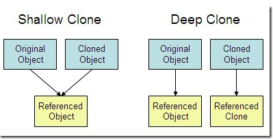
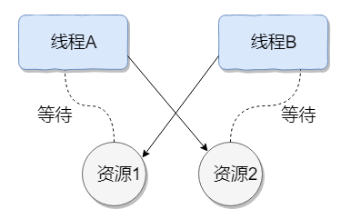

#### 构造器 Constructor 是否可被 override?

Constructor 不能被 override（重写）,但是可以 overload（重载）,所以你可以看到一个类中有多个构造函数的情况。

#### 重载和重写的区别

**重载**

发生在同一个类中，方法名必须相同，参数类型不同、个数不同、顺序不同，方法返回值和访问修饰符可以不同

**重写**

重写是子类对父类的允许访问的方法的实现过程进行重新编写,发生在子类中，方法名、参数列表必须相同，返回值范围小于等于父类，抛出的异常范围小于等于父类，访问修饰符范围大于等于父类。另外，如果父类方法访问修饰符为 private 则子类就不能重写该方法。**也就是说方法提供的行为改变，而方法的外貌并没有改变。**

#### Java 面向对象编程三大特性

封装，继承，多态

#### String 为什么是不可变的?

String 类中使用 final 关键字修饰字符数组来保存字符串，`private final char[] value`，所以 String 对象是不可变的。

#### String、StringBuffer 和 StringBuilder 的区别是什么? 

**可变性**

String 类中使用 final 关键字修饰字符数组来保存字符串，`private final char value[]`，所以 String 对象是不可变的。而 StringBuilder 与 StringBuffer 都继承自 AbstractStringBuilder 类，在 AbstractStringBuilder 中也是使用字符数组保存字符串`char[]value` 但是没有用 final 关键字修饰，所以这两种对象都是可变的。

**线程安全性**

StringBuffer 对方法加了同步锁或者对调用的方法加了同步锁，所以是线程安全的。StringBuilder 并没有对方法进行加同步锁，所以是非线程安全的。

**性能**

每次对 String 类型进行改变的时候，都会生成一个新的 String 对象，然后将指针指向新的 String 对象。StringBuffer 每次都会对 StringBuffer 对象本身进行操作，而不是生成新的对象并改变对象引用。相同情况下使用 StringBuilder 相比使用 StringBuffer 仅能获得 10%~15% 左右的性能提升，但却要冒多线程不安全的风险。

**对于三者使用的总结：**

1. 操作少量的数据: 适用 String
2. 单线程操作字符串缓冲区下操作大量数据: 适用 StringBuilder
3. 多线程操作字符串缓冲区下操作大量数据: 适用 StringBuffer

#### 自动装箱与拆箱

- **装箱**：将基本类型用它们对应的引用类型包装起来；
- **拆箱**：将包装类型转换为基本数据类型；

#### 接口和抽象类的区别是什么？

1. 接口的方法默认是 public，所有方法在接口中不能有实现(Java 8 开始接口方法可以有默认实现），而抽象类可以有非抽象的方法。
2. 接口中除了 static、final 变量，不能有其他变量，而抽象类中则不一定。

3. 一个类可以实现多个接口，但只能实现一个抽象类。接口自己本身可以通过 extends 关键字扩展多个接口。

4. 接口方法默认修饰符是 public，抽象方法可以有 public、protected 和 default 这些修饰符（抽象方法就是为了被重写所以不能使用 private 关键字修饰！）。

#### 构造方法有哪些特性？

1. 名字与类名相同。
2. 没有返回值，但不能用 void 声明构造函数。
3. 生成类的对象时自动执行，无需调用。

#### 在调用子类构造方法之前会先调用父类没有参数的构造方法,其目的是?

帮助子类做初始化工作。

 #### == 与 equals区别

**==** : 它的作用是判断两个对象的地址是不是相等。即，判断两个对象是不是同一个对象(基本数据类型==比较的是值，引用数据类型==比较的是内存地址)。

**equals()** : 它的作用也是判断两个对象是否相等。但它一般有两种使用情况：

- 情况 1：类没有覆盖 equals() 方法。则通过 equals() 比较该类的两个对象时，等价于通过“==”比较这两个对象。
- 情况 2：类覆盖了 equals() 方法。一般，我们都覆盖 equals() 方法来比较两个对象的内容是否相等；若它们的内容相等，则返回 true (即，认为这两个对象相等)。

#### 你重写过 hashcode 和 equals 么，为什么重写 equals 时必须重写 hashCode 方法？

是为了提高效率，采取重写hashcode方法，先进行hashcode比较，如果不同，那么就没必要在进行equals的比较了，这样就大大减少了equals比较的次数，这对比需要比较的数量很大的效率提高是很明显的，有时间同学看看JDK源码，没时间同学记住结论.


#### 线程有哪些基本状态,并描述每种状态?


#### final 关键字修饰这三个地方：变量、方法、类，会有什么作用

1. 对于一个 final 变量，如果是基本数据类型的变量，则其数值一旦在初始化之后便不能更改；如果是引用类型的变量，则在对其初始化之后便不能再让其指向另一个对象。
2. 当用 final 修饰一个类时，表明这个类不能被继承。final 类中的所有成员方法都会被隐式地指定为 final 方法。
3. 使用 final 方法的原因有两个。第一个原因是把方法锁定，以防任何继承类修改它的含义；第二个原因是效率。在早期的 Java 实现版本中，会将 final 方法转为内嵌调用。但是如果方法过于庞大，可能看不到内嵌调用带来的任何性能提升（现在的 Java 版本已经不需要使用 final 方法进行这些优化了）。类中所有的 private 方法都隐式地指定为 final。

#### Java 序列化中如果有些字段不想进行序列化，怎么办？

对于不想进行序列化的变量，使用 transient 关键字修饰。

transient 关键字的作用是：阻止实例中那些用此关键字修饰的的变量序列化；当对象被反序列化时，被 transient 修饰的变量值不会被持久化和恢复。transient 只能修饰变量，不能修饰类和方法。

#### 获取用键盘输入常用的两种方法

方法 1：通过 Scanner

```
Scanner input = new Scanner(System.in);
String s  = input.nextLine();
input.close();
```

方法 2：通过 BufferedReader

```
BufferedReader input = new BufferedReader(new InputStreamReader(System.in));
String s = input.readLine();
```

#### 既然有了字节流,为什么还要有字符流?

问题本质想问：**不管是文件读写还是网络发送接收，信息的最小存储单元都是字节，那为什么 I/O 流操作要分为字节流操作和字符流操作呢？**

回答：字符流是由 Java 虚拟机将字节转换得到的，问题就出在这个过程还算是非常耗时，并且，如果我们不知道编码类型就很容易出现乱码问题。所以， I/O 流就干脆提供了一个直接操作字符的接口，方便我们平时对字符进行流操作。如果音频文件、图片等媒体文件用字节流比较好，如果涉及到字符的话使用字符流比较好。


#### 描述深拷贝和浅拷贝

1. **浅拷贝**：对基本数据类型进行值传递，对引用数据类型进行引用传递般的拷贝，此为浅拷贝。
2. **深拷贝**：对基本数据类型进行值传递，对引用数据类型，创建一个新的对象，并复制其内容，此为深拷贝。



#### **说说&和&&的区别。**

&和&&都可以用作逻辑与的运算符，表示逻辑与（and），当运算符两边的表达式的结果都为true时，整个运算结果才为true，否则，只要有一方为false，则结果为false。

&&还具有短路的功能，即如果第一个表达式为false，则不再计算第二个表达式。

&还可以用作位运算符，当&操作符两边的表达式不是boolean类型时，&表示按位与操作，我们通常使用0x0f来与一个整数进行&运算，来获取该整数的最低4个bit位，例如，0x31 & 0x0f的结果为0x01。

#### final, finally, finalize的区别。

final 用于声明属性，方法和类，分别表示属性不可变，方法不可覆盖，类不可继承。内部类要访问局部变量，局部变量必须定义成final类型。

finally是异常处理语句结构的一部分，表示总是执行。

finalize是Object类的一个方法，在垃圾收集器执行的时候会调用被回收对象的此方法，可以覆盖此方法提供垃圾收集时的其他资源回收，例如关闭文件等。但是JVM不保证此方法总被调用

#### ArrayList和Vector的区别

这两个类都实现了List接口（List接口继承了Collection接口），他们都是有序集合，即存储在这两个集合中的元素的位置都是有顺序的

（1）同步性：

Vector是线程安全的，也就是说是它的方法之间是线程同步的，而ArrayList是线程序不安全的，它的方法之间是线程不同步的。如果只有一个线程会访问到集合，那最好是使用ArrayList，因为它不考虑线程安全，效率会高些；如果有多个线程会访问到集合，那最好是使用Vector，因为不需要我们自己再去考虑和编写线程安全的代码。

（2）数据增长：

ArrayList与Vector都有一个初始的容量大小，当存储进它们里面的元素的个数超过了容量时，就需要增加ArrayList与Vector的存储空间，每次要增加存储空间时，不是只增加一个存储单元，而是增加多个存储单元，每次增加的存储单元的个数在内存空间利用与程序效率之间要取得一定的平衡。

即Vector增长原来的一倍，ArrayList增加原来的0.5倍。

#### Arraylist 与 LinkedList 区别?

1.是否保证线程安全：ArrayList` 和 `LinkedList` 都是不同步的，也就是不保证线程安全；

2.底层数据结构： `Arraylist` 底层使用的是 Object 数组；`LinkedList` 底层使用的是 **双向链表** 数据结构

3.是否支持快速随机访问：** `LinkedList` 不支持高效的随机元素访问，而 `ArrayList` 支持。快速随机访问就是通过元素的序号快速获取元素对象(对应于`get(int index) `方法)。

4.内存空间占用： ArrayList的空 间浪费主要体现在在list列表的结尾会预留一定的容量空间，而LinkedList的空间花费则体现在它的每一个元素都需要消耗比ArrayList更多的空间（因为要存放直接后继和直接前驱以及数据）。

#### ArrayList的拓容机制

ArrayList每次扩容都为原先容量1.5倍


#### HashMap和Hashtable的区别

HashMap是Hashtable的轻量级实现（非线程安全的实现），他们都完成了Map接口，主要区别在于HashMap允许空（null）键值（key）,由于非线程安全，在只有一个线程访问的情况下，效率要高于Hashtable。


#### 说说List,Set,Map三者的区别？

List： List接口存储一组不唯一（可以有多个元素引用相同的对象），有序的 

对象 

Set(注重独一无二的性质): 不允许重复的集合。不会有多个元素引用相同的对象。 

Map(用Key来搜索的专家): 使用键值对存储。Map会维护与Key有关联的值。两个Key可以引用相 

同的对象，但Key不能重复，典型的Key是String类型，但也可以是任何对象。


 #### 什么是线程死锁

线程死锁描述的是这样一种情况：多个线程同时被阻塞，它们中的一个或者全部都在等待某个资源被释放。由于线程被无限期地阻塞，因此程序不可能正常终止。

如下图所示，线程 A 持有资源 2，线程 B 持有资源 1，他们同时都想申请对方的资源，所以这两个线程就会互相等待而进入死锁状态。



产生死锁必须具备以下四个条件：

1. 互斥条件：该资源任意一个时刻只由一个线程占用。
2. 请求与保持条件：一个进程因请求资源而阻塞时，对已获得的资源保持不放。
3. 不剥夺条件:线程已获得的资源在末使用完之前不能被其他线程强行剥夺，只有自己使用完毕后才释放资源。
4. 循环等待条件:若干进程之间形成一种头尾相接的循环等待资源关系。


#### 如何避免线程死锁?

我上面说了产生死锁的四个必要条件，为了避免死锁，我们只要破坏产生死锁的四个条件中的其中一个就可以了。现在我们来挨个分析一下：

1. **破坏互斥条件** ：这个条件我们没有办法破坏，因为我们用锁本来就是想让他们互斥的（临界资源需要互斥访问）。
2. **破坏请求与保持条件** ：一次性申请所有的资源。
3. **破坏不剥夺条件** ：占用部分资源的线程进一步申请其他资源时，如果申请不到，可以主动释放它占有的资源。
4. **破坏循环等待条件** ：靠按序申请资源来预防。按某一顺序申请资源，释放资源则反序释放。破坏循环等待条件。

#### 说说 sleep() 方法和 wait() 方法区别和共同点?

- 两者最主要的区别在于：**sleep 方法没有释放锁，而 wait 方法释放了锁** 。
- 两者都可以暂停线程的执行。
- Wait 通常被用于线程间交互/通信，sleep 通常被用于暂停执行。
- wait() 方法被调用后，线程不会自动苏醒，需要别的线程调用同一个对象上的 notify() 或者 notifyAll() 方法。sleep() 方法执行完成后，线程会自动苏醒。或者可以使用 wait(long timeout)超时后线程会自动苏醒。

#### HashMap和ConcurrentHashMap的区别

1、HashMap不是线程安全的，而ConcurrentHashMap是线程安全的。

2、ConcurrentHashMap采用锁分段技术，将整个Hash桶进行了分段segment，也就是将这个大的数组分成了几个小的片段segment，而且每个小的片段segment上面都有锁存在，那么在插入元素的时候就需要先找到应该插入到哪一个片段segment，然后再在这个片段上面进行插入，而且这里还需要获取segment锁。

3、ConcurrentHashMap让锁的粒度更精细一些，并发性能更好。

#### 现在有线程 T1、T2 和 T3。你如何确保 T2 线程在 T1 之后执行，并且 T3 线程在 T2 之后执行？

这个线程面试题通常在第一轮面试或电话面试时被问到，这道多线程问题为了测试面试者是否熟悉 join 方法的概念。答案也非常简单——可以用 Thread 类的 join 方法实现这一效果。

